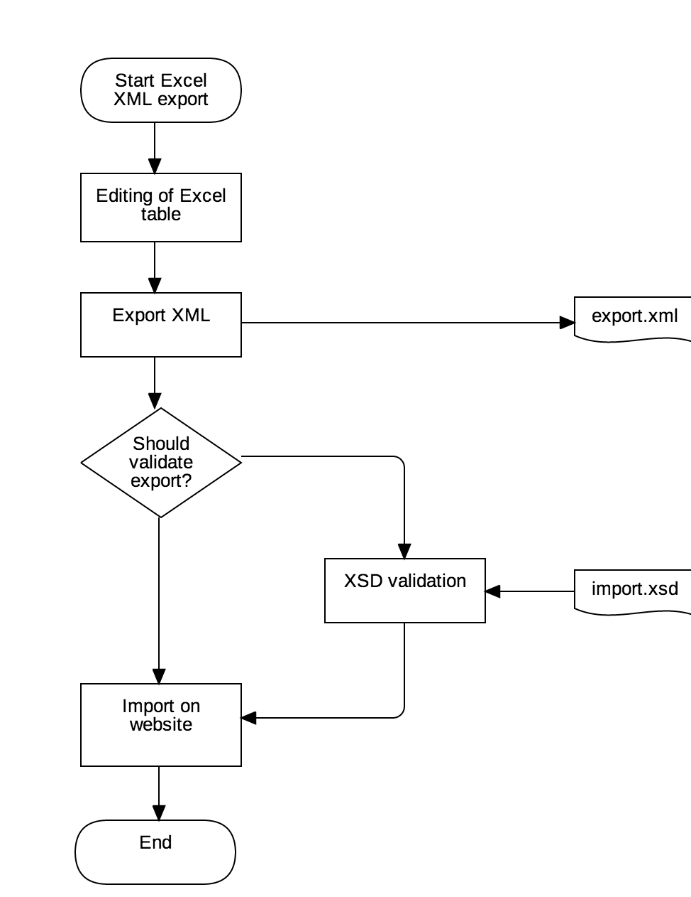
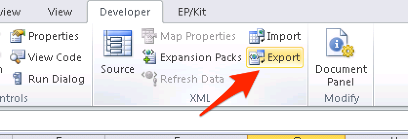
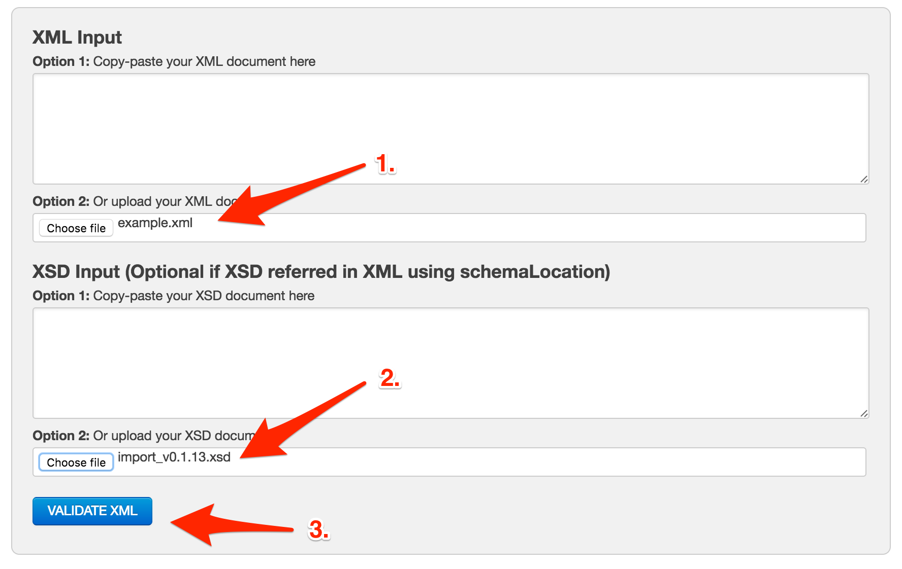

# Workflow of Excel export

## Steps

### 1. Editing Excel

Adding the require data to the cells. Some of the cells contains data validation for helping content editors.

#### Common mistakes:

-  **Mistake:** Leaving empty lines following the relevant data.
   
   **Solution:** Please remove all empty rows.
   
-  **Mistake:** Overiding data validations by copy-and-paste.

   **Solution:** You can avoid this mistake by pasting only values to cells.

### 2. Export XML file

Creating an XML file from Excel.

### 3. Optional: Validate the exported XML with XSD file

- Go to a XSD online validation webpage, like: [http://www.freeformatter.com/xml-validator-xsd.html](http://www.freeformatter.com/xml-validator-xsd.html).
- Upload the exported XML (1) and the validation schema file (aka: XSD) (2) to the form.
- Validate the XML file. (3)

### 4. Import XML on the live site

Give the exported XML to DTT responsible person to continue the process on live sites.